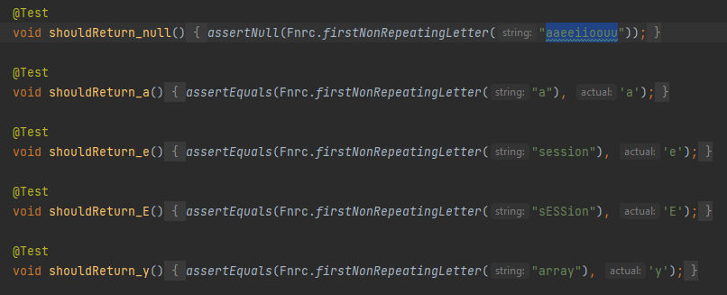
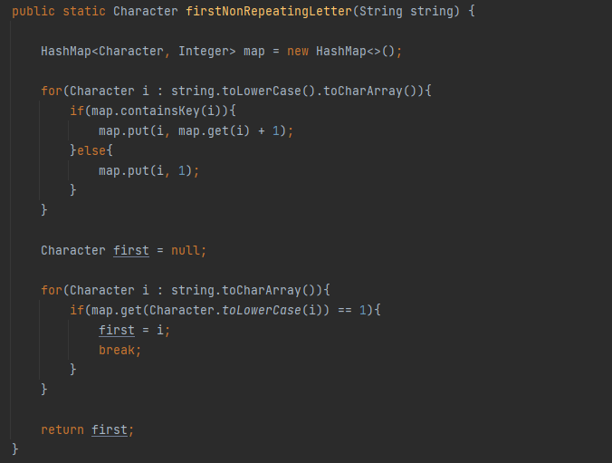
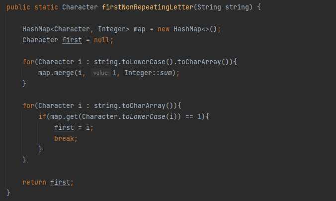

---
authors:
- blogferran
date: "2021-05-12"
diagram: false
tags:
- Katas
title: Kata First Non-Repeating Character
subtitle: [Enlace al repositorio](https://github.com/ferranjuanals/katas-formacion/tree/firstNonRepeatingCharacter-kata/firstNonRepeatingCharacter)
---

Esta kata consiste en crear una función llamada firstNonRepeatingLetter que retorne el primer carácter no repetido de una cadena. Como dificultad añadida la función debe ser case insensitive, es decir, no se diferenciará entre minúsculas y mayúsculas a la hora de comparar pero la función debe devolver el carácter inicial.

La resolución de esta kata la haré en Java y JUnit5, utilizando la plantilla que proporcionó Jorge Aguiar.

###Test
Para realizar los test hay que tener en cuenta las condiciones que nos marca el enunciado:
- Si no hay caracteres no repetidos la función debe retornar una cadena vacía o null.
- Si hay más de dos caracteres no repetidos la función sólo debe devolver el primero.
- La función no diferenciará entre minúsculas y mayúsculas.

Estos son los test que creé para la función.

###Solución

El problema lo he solucionado con dos bucles for. El primero que rellena un mapa dónde los caracteres son las claves y el valor contabiliza el número de ocurrencias del mismo. Y el segundo donde se comprueba para cada carácter de la cadena si su valor es 1 en el mapa, en caso afirmativo se guarda el carácter y se rompe la iteración del bucle. En caso de que no se encuentre ningún carácter con valor 1 en el mapa la función retornará null.

###Refactorización
Una vez validados los test busqué cómo podía refactorizar la función y lo único que se me ocurrió en un tiempo razonable fue una mejor forma de rellenar el mapa en el primer bucle.

Todavía me falta mucha práctica, seguiré practicando.
